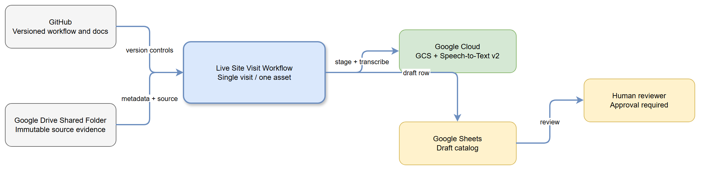

# Live workflow architecture

## Phase 2 scope

Phase 2 begins with **one** visit subfolder in the approved Google Drive Shared Folder. The workflow must enumerate that folder, create an auditable manifest, stage and transcribe one approved video, propose an extraction and catalog row, and stop for human review. It does not rename Drive files, publish catalog records, create reports, create Asana tasks, or automate multiple visit folders.

## Architecture and data flow

```text
Google Drive Shared Folder
  -> selected visit subfolder (one only)
  -> visit manifest and structured logs
  -> staged copy of one approved video
  -> ffprobe inspection and mono 16 kHz WAV extraction
  -> GCS staging path
  -> Speech-to-Text v2 BatchRecognize (Chirp; one file, low concurrency)
  -> transcript record
  -> L1 extraction proposal (strict JSON)
  -> draft Google Sheets catalog row
  -> human approval gate
  -> optional future rename and publication
```

GitHub remains the versioned source of truth for workflow definitions, documentation, decisions, and prompt templates. Google Drive holds immutable source evidence; the original Drive file ID and name remain in every manifest and proposed catalog row. Google Cloud handles transient staging, transcription, and structured processing. Google Sheets is a proposed catalog destination, not the source of evidence.

Cloud Run Jobs use the directly attached
`site-visit-workflow@shir-sitevisit.iam.gserviceaccount.com` service account
and ambient ADC; no key files or impersonation are permitted.



## Components and contracts

| Stage | Input | Output | Guardrail |
| --- | --- | --- | --- |
| Drive intake | Shared Folder ID | One visit manifest | List immediate children only; select exactly one visit |
| Media preparation | One approved Drive video | Probe data and WAV | Source Drive file is never edited or deleted |
| Transcription | WAV in GCS | Transcript status and GCS URI | One request per file; retry an empty transcript once, then `NEEDS_REVIEW` |
| L1 extraction | Transcript text and source ID | Strict JSON proposal | No trade, priority, severity, tasks, reports, or rename |
| Catalog draft | Validated extraction | One idempotent draft row | Update by stable source key; do not publish automatically |
| Review | Draft extraction and catalog row | Approval or correction | Proposed descriptive names require explicit approval |

## How to update this later

When adding a service, record its trigger, input/output schema, owner, environment variables, failure mode, and review impact here and in the relevant runbook. Update the diagrams and ADR when a new external system or automation boundary is introduced.
