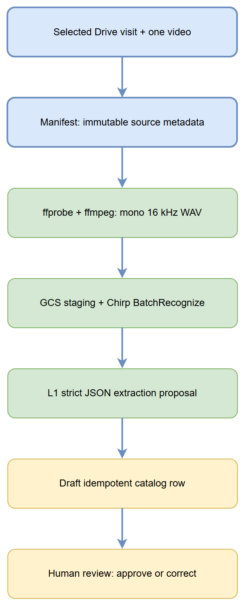
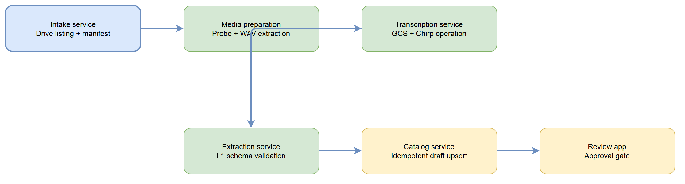

---
title: Live Site Visit Workflow — Project Summary
date: 2026-09-16
version: 1.1
audience: Engineering Team, Architects, Stakeholders
---

# Executive Summary

The Live Site Visit Workflow is a tested, safety-first Python foundation for processing one site-visit video from an approved Google Drive Shared Folder. GitHub controls versioned code, prompts, and operating records. A Cloud Run Job is designed to run directly as the existing `site-visit-workflow@shir-sitevisit.iam.gserviceaccount.com` identity, with no user-managed key file. The first Phase 2 pass creates auditable outputs and stops at a human review gate before any source rename or catalog publication. No live Drive or cloud operation has been run yet.

# Architecture Overview


The Drive source remains immutable evidence. A manifest connects the selected source asset to staged media, transcription results, extraction proposals, and the draft catalog row.

# Processing Pipeline



The pipeline processes one selected asset: discovery, manifest, local media preparation, GCS staging, Chirp transcription, constrained L1 extraction, catalog draft, and human review.

# Core Components



The `src/site_visit_workflow/` Python package implements an explicit CLI boundary for intake, staging, media preparation, transcription submission, empty-transcript evaluation, L1 result validation, catalog drafting, approved rename, and approved catalog publication. The `infra/` folder supplies a Cloud Run Job container and build configuration. The `services/`, `libs/`, and `apps/` folders remain reserved for future separation as the workflow grows.

# API Contracts / Message Schemas

The manifest captures immutable Drive metadata. The L1 extraction contract is limited to source asset identifier, location, issue description, suggested descriptive name, and confidence note. The catalog row uses the immutable Drive file ID as its idempotent key.

# Infrastructure & Deployment

The intended processing platform is a Cloud Run Job directly attached to the existing dedicated service account. Before deployment, validate its access to the specific Drive folder, GCS staging bucket, Speech-to-Text v2, and target Sheet; retain source and staged artifacts. The account identity is locked by configuration for deployed operation, and the live path uses only the direct attachment.

# Extension Patterns

The implementation keeps manifest generation, media preparation, transcription, extraction, and catalog drafting as independently testable CLI stages. Preserve each stage's identifiers, timestamps, input/output locations, and errors. Add automation only after the single-folder human-review rules have been measured.

# Rules & Anti-Patterns

Do not modify `pilot/`, `_design/`, or Drive source media. Do not automate a rename, accept an empty transcript, publish a catalog record without review, or introduce reports/tasks/multi-folder automation in this phase.

# Dependencies

The Python package declares Google Drive, Cloud Storage, Speech-to-Text, and authentication libraries in `pyproject.toml`. It uses `ffprobe` and `ffmpeg` only for the explicit local media-preparation stage. Vertex AI and Google Sheets are deliberately external-call boundaries and must remain gated by the documented prompts and approval record.

# Code Structure

```text
src/site_visit_workflow/  tested CLI, models, credential boundary, and cloud gateways
tests/                    offline safety and validation coverage
infra/                    Cloud Run Job container and build configuration
apps/                     future review and reporting surfaces
services/                 future independently deployed processing services
libs/                     future shared abstractions
docs/       canonical architecture, auth, operations, runbooks, ADRs, research
prompts/    versioned Drive intake, L1 extraction, catalog, and prompt-governance templates
```
